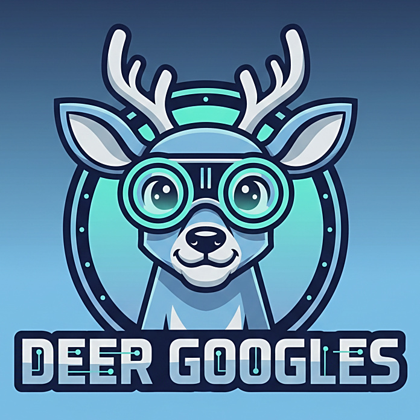

A Project for exploring deer vision, cameras, and map / GIS transformations

## Using the Python Notebook

This project includes a Python notebook that demonstrates the process of simulating deer vision. Follow the steps below to understand the workflow:

### Steps

1. **Convert Pixels to Linear RGB**  
    The first step involves converting the image's pixel data into a linear RGB color space. This ensures accurate color transformations.

2. **Apply Transformation on the Matrix**  
    A transformation is applied to the linear RGB matrix to simulate how deer perceive colors differently from humans.

3. **Return to Displayable RGB Colorset**  
    The transformed matrix is converted back into a displayable RGB format for visualization.

4. **Machine Learning for Distance and Blur**  
    Machine learning models are used to estimate distances in the image. Objects farther away are blurred to mimic how deer perceive depth.

5. **Enhance Blue Tones for UV Spectrum Simulation**  
    The final step increases the reliance on blue tones in the image to simulate the enhanced UV spectrum sensitivity of deer vision.

Explore the notebook to see these steps in action and experiment with the parameters to better understand the transformations.